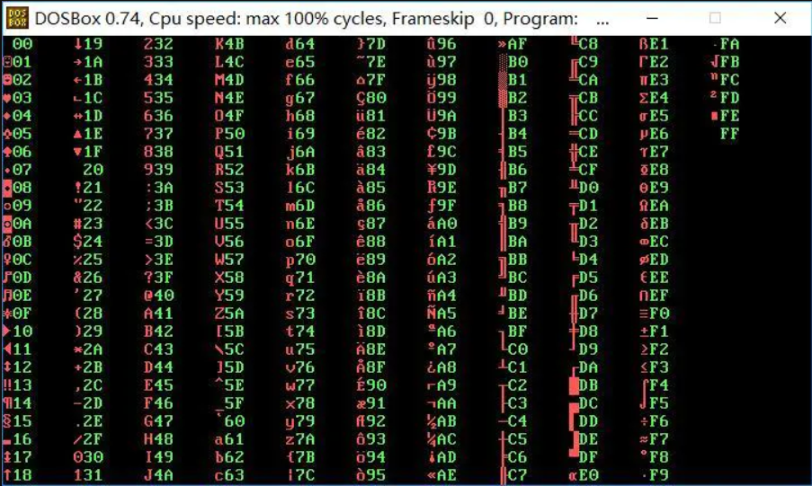

利用汇编语言显示字符的ascii码
<!--more-->

编译步骤:<br>
把此文件复制到dosbox86\tc中,<br>

运行dosbox86<br>
File->DOS Shell<br>
cd \tc<br>
tc<br>
Alt+F选择File->Load->ascii.c<br>
Alt+C选择Compile->Compile to OBJ 编译<br>
Alt+C选择Compile->Line EXE file 连接<br>
Alt+R选择Run->Run 运行<br>
Alt+R选择Run->User Screen 查看结果<br>
C语言程序如下：

```C
#include <dos.h>
#include <bios.h>
main()
{
   unsigned char a=0, hex[3];
   char far *p = (char far *)0xB8000000;
   int i, j, k;
   _AX = 0x0003;
   geninterrupt(0x10);     /* 设置视频模式为80*25文本模式, 同时起到清屏效果 */
   for(j=0; j<11; j++)     /* 共11列 */
   {
      p = (char far *)0xB8000000;
      p += j*7*2;          /* 计算第j列第0行的地址, 注意各列之间相距7个字符(含空格) */
                           /* 汇编中可以根据前后两列首地址相差14字节的规律,用加法计算
                              出下一列的地址
                            */
      for(i=0; i<25; i++)  /* 每列输出25个ASCII码, 即每列有25行 */
      {
         *p = a;           /* 输出当前ASCII字符 */
         *(p+1) = 0x0C;    /* 背景为黑色, 前景为高亮度红色 */
         sprintf(hex, "%02X", a);
                           /* 汇编中可以利用上课讲过的循环左移4位的方法把a的值转化
                              成2位十六进制并保存到数组hex中
                            */
         for(k=0; k<2; k++)/* 输出2位十六进制数 */
         {
            *(p+2+k*2) = hex[k];
            *(p+2+k*2+1) = 0x0A; /* 背景为黑色, 前景为高亮度绿色 */
         }
         a++;
         if(a==0)          /* 若a从0xFF变成0x00, 表示256个ASCII码已穷尽 */
            goto done;
         p += 160;         /* p指向第j列的第i+1行 */
      }
   }
   done:
   bioskey(0);             /* 汇编中可以用mov ah,0; int 16h;代替此函数调用 */
}
```
对应的汇编代码如下：
```
assume cs:code,ds:data,ss:stack

data segment
    a db 0h;
    color_ascii db  0Ch ;背景黑色，前景高亮度红色   00001100
    color_num   db  0Ah ;背景黑色，前景高亮度绿色   00001010
data ends

stack segment
    db 16 dup (0)
stack ends

code segment
    start:
    cls:
        mov ax,0B800H   ;显存地址
        mov es,ax
        mov bx,0
        mov cx,4000     ;文本模式显示25行，80字  
    s:
        mov dx,0
        mov es:[bx],dx        
        add bx,2
        loop s

        ;实现清屏

        mov ax,data
        mov ds,ax
        mov ax,stack
        mov ss,ax
        mov sp,16
        mov ax,0B800H   ;第1行起始位置
        mov es,ax

        mov dl,0    ;从第0个字符开始
        mov bx,0
        mov cx,11 
        mov di,0  

        loop_x:
            push cx
            mov cx,25
            loop_y:
                push cx
                mov al,dl
                mov es:[bx][di],al  ;写ASCII码
                mov ah,ds:[1]
                mov es:[bx][di+1],ah    ;写ASCII码的属性
                add di,2    ;写完一个，移动两个字节

                mov al,dl
                mov ah,0
                mov cl,4
                rol ax,cl

                cmp ah,0Ah
                jb  num1
                jnb character1

                num1:
                    add ah,30h

                character1:
                    cmp ah,10h
                    jnb write1
                    add ah,37h

                write1:
                    mov es:[bx][di],ah  ;写ASCII码对应的数
                    mov ah,ds:[2]
                    mov es:[bx][di+1],ah    ;写数的属性
                    add di,2    ;写完一个，移动两个字节

                mov al,dl
                mov ah,0
                mov cl,4
                rol ax,cl
                ror al,cl

                cmp al,0Ah
                jb  num2
                jnb character2

                num2:
                    add al,30h

                character2:
                    cmp al,10h
                    jnb write2
                    add al,37h

                write2:
                    mov es:[bx][di],al  ;写ASCII码对应的数
                    mov ah,ds:[2]
                    mov es:[bx][di+1],ah    ;写数的属性
                    add di,2    ;写完一个，移动两个字节

                inc dl      ;显示的ascii码加1

                cmp dl,0    ;ascii码为0则跳转至exit
                je  exit 

                add bx,160
                sub di,6

                pop cx
            loop loop_y
            pop cx
            
            mov al,12
            sub al,cl
            mov bl,14
            mul bl
            mov di,0
            add di,ax
            
            ;切换到下一列

            mov bx,0

        loop again

        again:  jmp loop_x

        exit:
            mov ah,0
            int 16h

code ends
end start
```
结果如下：


<br>DosBox下载的链接在下面给出
编译运行的方法如下：
运行DosBox86
把.asm文件放到masm文件夹中
命令行输入masm xxx(xxx是你的asm文件名)
紧跟着按三下回车
接着输入link xxx
继续按三下回车
生成可执行文件xxx.exe
输入xxx来运行
