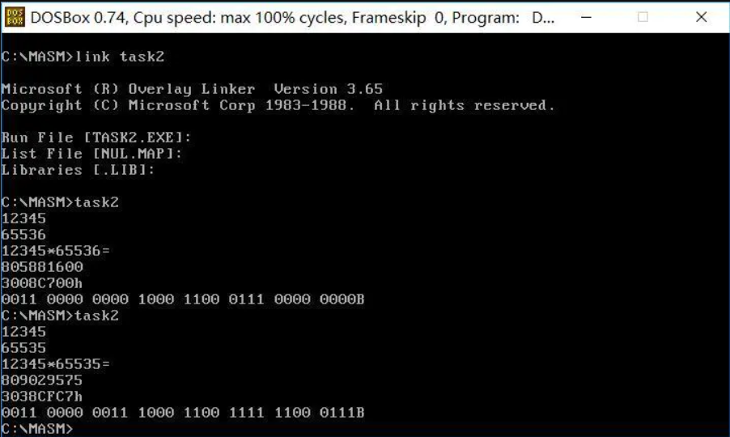

利用汇编语言写一个乘法器
<!--more-->
```
.386
assume cs:code,ds:data,ss:stack

data segment    use16
    dec_mul dw 10
    num1    db 6
            db ?
            db 6 dup(?)
    num2    db 6
            db ?
            db 6 dup(?)
data ends

stack segment stack
    db 100h dup (?)
stack ends

code segment    use16
    main:  
        mov ax,data
        mov ds,ax
        mov dx,offset num1
        mov ah,0Ah
        int 21h                 ;读入第一个数据

        mov dl,0Dh
        mov ah,2
        int 21h

        mov dl,0Ah
        mov ah,2
        int 21h                 ;移动光标至下一行行首

        mov dx,offset num2
        mov ah,0Ah
        int 21h                 ;读入第二个数据

        mov dl,0Dh
        mov ah,2
        int 21h

        mov dl,0Ah
        mov ah,2
        int 21h                 ;移动光标至下一行行首

        xor cx,cx
        mov cl,num1[1]
        jcxz done
        mov bx,offset num1+2
        jmp again1
    done:
        mov ah,4Ch
        int 21h
    again1:
        mov dl,[bx]
        mov ah,2
        int 21h
        mov dh,30h
        sub dl,dh
        mov [bx],dl
        inc bx
        loop again1             ;显示第一个乘数

        mov dl,'*'
        mov ah,02h
        int 21h                 ;显示乘号

        xor cx,cx
        mov cl,num2[1]
        jcxz done
        mov bx,offset num2+2
    again2:
        mov dl,[bx]
        mov ah,2
        int 21h
        mov dh,30h
        sub dl,dh
        mov [bx],dl
        inc bx
        loop again2             ;显示第二个乘数

        mov dl,'='
        mov ah,02h
        int 21h                 ;显示等于号

        mov dl,0Dh
        mov ah,2
        int 21h

        mov dl,0Ah
        mov ah,2
        int 21h                 ;移动光标至下一行行首


        xor cx,cx
        mov cl,num1[1]
        mov bx,offset num1+2
        xor dx,dx
        xor ax,ax
        mov al,[bx]
        dec cx
        inc bx
        jcxz out_1
    again_1:
        mul dec_mul
        add al,[bx]
        inc bx
        loop again_1               
    out_1:
        push ax
        xor cx,cx
        mov cl,num2[1]
        mov bx,offset num2+2
        xor dx,dx
        xor ax,ax
        mov al,[bx]
        dec cx
        inc bx
        jcxz out_2
    again_2:
        mul dec_mul
        add al,[bx]
        inc bx
        loop again_2
    out_2:
        mov bx,ax
        pop ax
        mov dx,0
        mul bx
        ;dx:ax存放乘积的高、低16位

        push ax
        push dx

        push ax
        mov ax,dx
        mov cl,16
        shl eax,cl
        pop ax
        ;eax存放乘积
        mov cl,0
    dec_:
        xor edx,edx
        mov ebx,10
        div ebx
        push edx
        inc cl
        cmp eax,0
        jne dec_
    dec_show:
        pop edx
        add dl,30h
        mov ah,02h
        int 21h
        loop dec_show

        mov dl,0Dh
        mov ah,2
        int 21h

        mov dl,0Ah
        mov ah,2
        int 21h                 
        ;移动光标至下一行行首

        pop dx
        pop ax          
        ;dx:ax存放乘积的高、低16位
        push ax
        push dx
        push ax
        mov ax,dx
        ;mov ax,6
        ;显示十六进制
        mov cl,0
    hex_dx:
        mov dx,ax
        mov bx,ax
        and bx,0fff0h
        sub dx,bx
        push dx
        inc cl
        push cx
        xor cx,cx
        mov cl,4
        shr ax,cl
        pop cx
        test ax,ax
        jnz hex_dx

    hex_no_show_dx:
        cmp cx,0
        je  hex_out_dx
        dec cl
        pop dx
        mov dh,0
        cmp dl,dh        
        je hex_no_show_dx
        inc cl
        mov dh,0
        cmp cl,dh
        je hex_out_dx

        xor ax,ax
        mov ah,02h
        jmp hex_compare_dx
    hex_show_dx:
        pop dx
    hex_compare_dx:
        mov dh,9
        cmp dl,dh
        ja  hex_show_char_dx
    hex_show_num_dx:
        add dl,30h
        int 21h
        loop hex_show_dx

        jmp hex_out_no_dx
    hex_show_char_dx:
        add dl,55
        int 21h
        loop hex_show_dx
    hex_out_no_dx:
        jmp hex_ax_has_zero
    hex_out_dx:
        pop ax
        mov cl,0
    hex_ax:
        mov dx,ax
        mov bx,ax
        and bx,0fff0h
        sub dx,bx
        push dx
        push cx
        xor cx,cx
        mov cl,4
        shr ax,cl
        pop cx
        inc cl
        test ax,ax
        jnz hex_ax

        xor ax,ax
        mov ah,02h
    hex_show_ax:
        pop dx
        mov dh,9
        cmp dl,dh
        ja  hex_show_char_ax
    hex_show_num_ax:
        add dl,30h
        int 21h
        loop hex_show_ax

        jmp hex_out_ax
    hex_show_char_ax:
        add dl,55
        int 21h
        loop hex_show_ax
    hex_out_ax:
        mov dl,'h'
        mov ah,2
        int 21h
        jmp hex_out_zero
    hex_ax_has_zero:
        pop ax
        mov cl,0
    hex_ax_zero:
        mov dx,ax
        mov bx,ax
        and bx,0fff0h
        sub dx,bx
        push dx
        push cx
        xor cx,cx
        mov cl,4
        shr ax,cl
        pop cx
        inc cl
        test ax,ax
        jnz hex_ax_zero

        push cx
        mov dx,4
        sub dx,cx
        mov cx,dx
        cmp cx,0
        je hex_no_zero
    hex_show_zero:
        mov dl,'0'
        mov ah,02h
        int 21h
        loop hex_show_zero
    hex_no_zero:
        pop cx
        xor ax,ax
        mov ah,02h
    hex_show_ax_zero:
        pop dx
        mov dh,9
        cmp dl,dh
        ja  hex_show_char_ax_zero
    hex_show_num_ax_zero:
        add dl,30h
        int 21h
        loop hex_show_ax_zero

        jmp hex_out_ax
    hex_show_char_ax_zero:
        add dl,55
        int 21h
        loop hex_show_ax_zero
    hex_out_ax_zero:
        mov dl,'h'
        mov ah,2
        int 21h
    hex_out_zero:
        mov dl,0Dh
        mov ah,2
        int 21h

        mov dl,0Ah
        mov ah,2
        int 21h                 ;移动光标至下一行行首

        pop dx
        ;pop ax
        ;dx:ax存放乘积的高、低16位
        ;目前ax还在栈中
        mov ax,dx
        mov cl,16
    bin_show_dx:
        mov dx,ax
        mov bx,ax
        and bx,07fffh
        sub dx,bx
        push ax
        xor ax,ax
        mov ah,02h
        push cx
        mov cx,15
        shr dx,cl
        add dl,30h
        int 21h
        pop cx
        cmp cx,16
        je  bin_dx
        mov ax,cx
        mov dl,4
        div dl
        cmp ah,1
        jnz bin_dx
        mov dl,' '
        mov ah,02h
        int 21h
    bin_dx:
        pop ax
        shl ax,1
        loop bin_show_dx

        pop ax
        mov cl,16
    bin_show_ax:
        mov dx,ax
        mov bx,ax
        and bx,07fffh
        sub dx,bx
        push ax
        xor ax,ax
        mov ah,02h
        push cx
        mov cx,15
        shr dx,cl
        pop cx
        add dl,30h
        int 21h
        mov ax,cx
        mov dl,4
        div dl
        cmp ah,1
        jnz bin_ax
        cmp al,0
        jz  bin_ax
        mov ah,02h
        mov dl,' '
        int 21h
    bin_ax:
        pop ax
        shl ax,1
        loop bin_show_ax

        mov dl,'B'
        mov ah,02h
        int 21h

        mov ah,4Ch
        int 21h
code ends
end main
```
结果如下：

